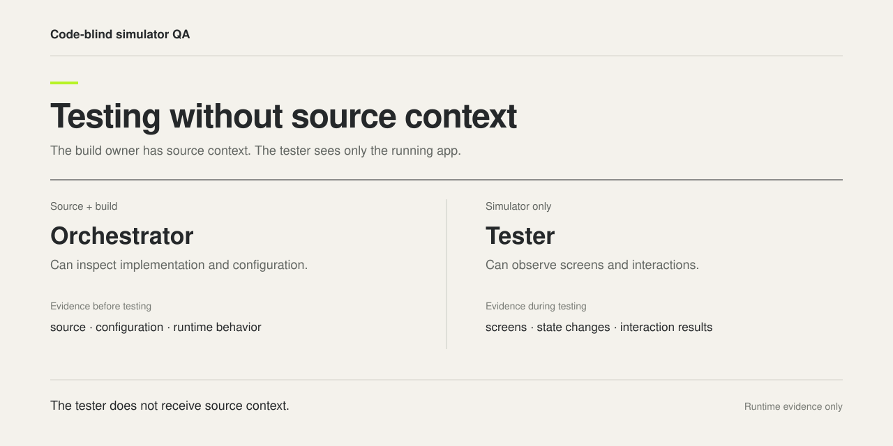
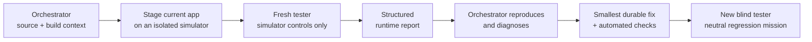

<p align="center">
  
</p>

<h1 align="center">Code-Blind Simulator QA</h1>

<p align="center"><strong>The orchestrator knows the code; the tester does not.</strong></p>

<p align="center">
  An Agent Skill for independent, runtime-only iOS Simulator testing.<br>
  It separates implementation context from product judgment.
</p>

<p align="center">
  <a href="https://github.com/henryvn27/code-blind-simulator-qa/actions/workflows/validate.yml"></a>
  <a href="LICENSE"></a>
  <a href="https://agentskills.io"></a>
</p>

## Install

```bash
npx skills add henryvn27/code-blind-simulator-qa -g -a codex -y
```

Then ask your agent:

```text
Use $code-blind-simulator-qa to run independent black-box QA against the staged iOS app.
```

Designed for Codex. The core workflow is portable to any agent harness that can create fresh-context workers and restrict them to simulator controls.

## The idea

An implementation-aware agent is good at building, diagnosing, and fixing. It is also biased by what it already knows: intended behavior, test coverage, known defects, architecture, and the fix it just wrote.

This skill keeps that context with the orchestrator and gives each tester only a live app, one bounded user mission, and simulator controls.

| The orchestrator knows | The tester knows |
| --- | --- |
| Repository, requirements, source, tests, builds, known risks | Product name, user mission, Simulator UDID, visible runtime behavior |
| How to stage, diagnose, fix, and validate | How to observe, operate, reproduce, and report |
| Every prior finding | No prior finding and no proposed fix |

The tester reports symptoms. The orchestrator adjudicates causes.

## How it works



The skill provides the isolation contract, staging checklist, mission lanes, report schema, contamination rules, adjudication loop, and a reusable [tester prompt](references/tester-prompt.md).

## The boundary

The tester receives:

- one exact Simulator UDID;
- one bounded, user-facing mission;
- the bundle identifier only when lifecycle controls require it;
- simulator observation, accessibility, interaction, screenshot, and lifecycle tools;
- a strict evidence and report contract.

The tester never receives:

- a repository or worktree path;
- source, tests, diffs, build logs, issues, acceptance reports, or known bugs;
- prior QA, likely root causes, implementation names, or proposed fixes;
- filesystem, shell, Git, build, tracker, or source-search permission.

> [!IMPORTANT]
> Source blindness is an orchestration boundary, not a cryptographic sandbox. Use a fresh context, expose only simulator tools when your harness supports tool scoping, and reject any report contaminated by implementation knowledge.

## What to test

Use non-overlapping missions so independent testers do not contaminate one another:

1. **First run and recovery** — onboarding, permission explanation, denial, Settings recovery, unavailable capability, clean relaunch.
2. **Returning-user behavior** — primary journeys, preferences, cancellation, persistence, relaunch, background and foreground.
3. **Visual and accessibility stress** — compact layouts, appearance, large text, scrolling, safe areas, contrast, touch targets, semantics, Reduce Motion.

Every finding must include severity, exact actions, visible before-state, expected and actual user-visible behavior, reproducibility, evidence, and whether it blocked coverage.

## Why it is useful

Code-blind QA is especially good at exposing:

- controls that render but do nothing;
- permission flows that work only on the happy path;
- persistence and lifecycle failures;
- accessibility semantics that disagree with the visible UI;
- visual defects the implementation agent has learned to look past;
- claims that pass tests but fail in the running product.

It complements automated tests. It does not replace them.

## Honest limits

Simulator evidence cannot prove real sensors, camera input, physical haptics, device-only performance or energy, signing, provisioning, or distribution. Those gates stay unverified until they pass on the required hardware or service.

The skill also cannot make a source-blind promise when every worker has unrestricted filesystem and shell access. In that environment, the prompt establishes a behavioral rule; the orchestrator must audit the report for contamination.

## Repository layout

```text
SKILL.md                    Orchestration workflow
references/tester-prompt.md Fresh-context tester template
agents/openai.yaml          Codex display metadata
scripts/validate.sh         Dependency-free structural checks
```

Validate a change locally:

```bash
bash scripts/validate.sh
npx skills add . --list
```

## License

[MIT](LICENSE)
